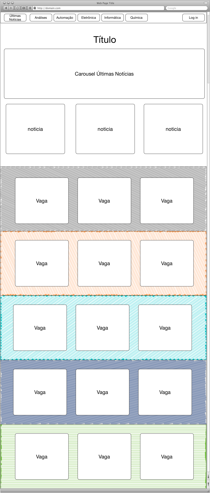
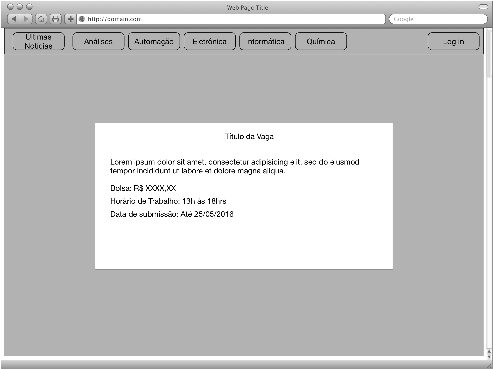
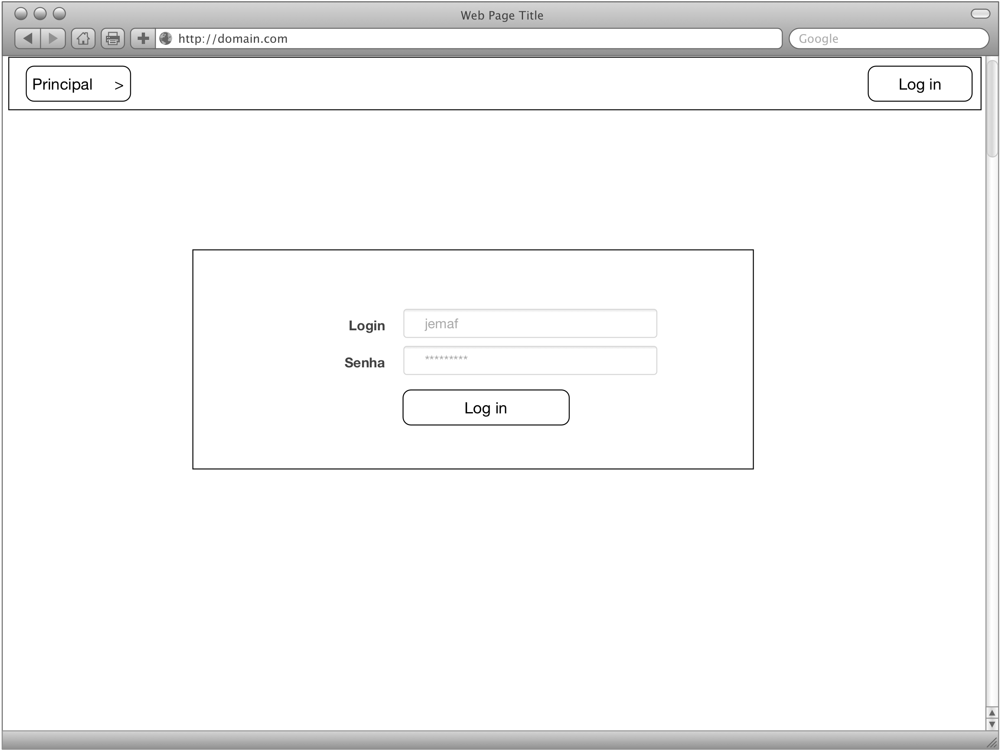
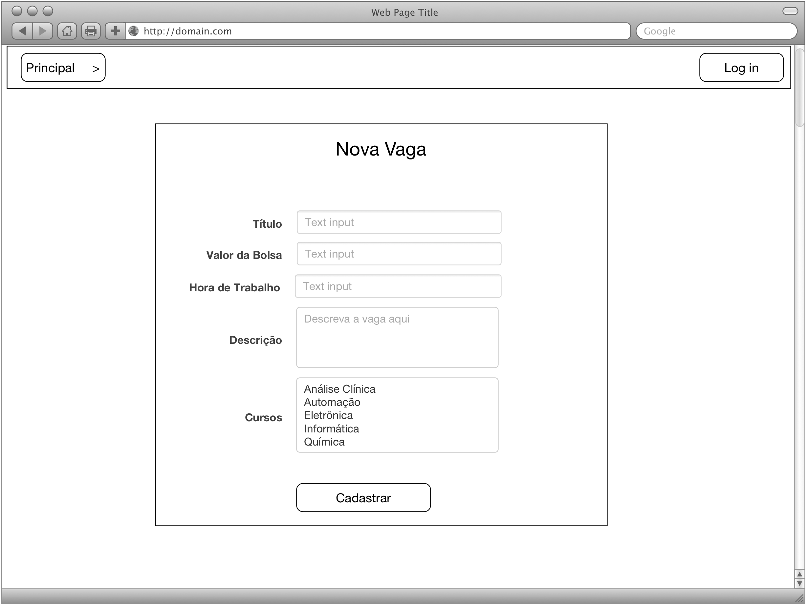

# Prova de Recuperação -- HTML, CSS & JavaScript

### Desenvolvimento de Aplicações Web 

João Eduardo Montandon

Setor de Informática - COLTEC/MG

Valor: 30 pontos

### Material de consulta

É permitida a consulta **somente** aos materiais listados abaixo:

* [w3schools](http://www.w3schools.com/)
* [Bootstrap: documentação](http://getbootstrap.com/)
* Slides e exercícios feitos em sala de aula.
* Material do Seminários de Bootstrap.

## Portal de Estágio (20 pontos)

O colégio decidiu por implementar um portal para divulgação de estágio profissional para os alunos do colégio. Você foi selecionado como responsável para desenvolver um protótipo do portal. O protótipo do portal deverá ser composto por 4 partes principais:

* **Principal:** Representa a página principal do sistema
* **Descrição:** Contém detalhes de um estágio específico
* **Login:** Login das empresas que desejam cadastrar novas vagas
* **Cadastro:** Formulário para cadastro de novas vagas

O layout de todas as partes deverá ser implementado com utilizando os conceitos de design responsivo, possuindo pelo menos dois modelos: Mobile e Desktop. Ainda, está permitido o uso do framework `Bootstrap`. Os requisitos de cada página estão descritos nas seções abaixo:

### Principal

Página principal do sistema. Seu principal propósito é listar as vagas presentes. As vagas deverão ser listadas em 5 áreas diferentes, representando cada área um curso diferente. Cada área deverá adotar um estilo próprio para diferenciá-la das demais, como cor de fundo, título, ícone, etc. 

Também deverá ser reservado uma área para contemplar as últimas notícias relacionado ao setor de estágio. Essas notícias deverão estar disponibilizadas em um caroussel, de preferência no topo da página.

As vagas de estágio deverão ser exibidas no formato de cartões. Cada cartão deverá mostrar a descrição do estágio, valor da bolsa, e data de cadastro da vaga. O estilo do cartão deverá ser customizado por meio de propriedades CSS. 

Ainda, um botão detalhes deverá estar presente no cartão. Ao clicar nesse botão, um modal deverá aparecer exibindo todos os detalhes da vaga. O modal será descrito com mais detalhes em sua seção específica.

As áreas da página (Últimas notícias, Análises Clínicas, Automação, Eletrônica, Informática) deverão estar presentes no menu da página principal e devem referências suas respectivas áreas. Ainda, um mecanismo de scrollspy deve ser implementado para as opções das áreas mencionadas acima.

A Figura abaixo fornece uma sugestão de layout da página.

### Descrição

A descrição listará os dados de uma vaga de estágio selecionada na página Principal. Mais especificamente essa descrição deverá estar contida em um modal, que será exibido ao clicar no botão "Detalhes". Esse modal deverá exibir as seguintes informações:

* Título 
* Descrição 
* Valor da bolsa 
* Horário de trabalho 
* Data de submissão

A Figura abaixo fornece uma sugestão de layout de página.

### Login

Essa página deverá conter o formulário de login para as empresas que desejarem cadastrar uma nova vaga. Esse formulário deverá ter os campos login (texto) e senha (password), além de um botão (submit) para efetuação do login. O formulário de login deverá ficar centralizado na tela, e dentro de uma div com estilo de cartão.

A Figura abaixo fornece uma sugestão de layout de página.

### Cadastro

A página de cadastro deverá conter as informações necessárias para o cadastro de uma nova vaga. Para isso, será necessário a implementação de um formulário, onde a empresa que irá disponibilizar a vaga deverá preencher os seguintes campos, com os respectivos tipos:

* Título da vaga (texto)
* Descrição (texto)
* Cursos elegíveis para vaga (seleção múltipla)
* Valor da bolsa (numérico)
* Quantidade de horas semanais de trabalho (numérico)

Assim como na página de login, o formulário de cadastro deverá ficar centralizado na página. Ainda, você deverá utilizar placeholders para indicar como os campos deverão ser preenchidos.

A Figura abaixo fornece uma sugestão de layout de página.

### Navegação

As seguintes páginas deverão ser acessadas por meio de um menu, que deverá ficar fixa no topo, e estar visível a todo o instante. É importante ressaltar que, apesar de referenciar as mesmas páginas, a estrutura dos itens do menu deverão se diferenciar para cada página. A árvore abaixo mostra como deverá organizado o menu em cada uma das páginas:

* Principal
	* Últimas Notícias
	* Análises Clínicas
	* Automação
	* Eletrônica
	* Informática
	* Química
	* Login (alinhado a direita)
* Login
	* Principal (deverá redirecionar para página principal) 
		* Últimas Notícias
		* Análises Clínicas
		* Automação
		* Eletrônica
		* Informática
		* Química
	* Login (alinhado a direita)
* Cadastro
	* Principal (deverá redirecionar para página principal) 
		* Últimas Notícias
		* Análises Clínicas
		* Automação
		* Eletrônica
		* Informática
		* Química 
	* Login (alinhado a direita)

## JavaScript: Funções matriciais (10 pontos)

Implemente uma função que crie matrizes com base em uma função matricial que leva em consideração os índices da matriz. A função matricial deverá ser enviada por parâmetro, na forma de função.

Implemente os seguintes critérios:

* `m[i,j] = i + j`
* `m[i,j] = i * j`
* `m[i,j] = i == j ? 1 : 0`
* `m[i,j] = i^2/(j+1)`
* `m[i,j] = i > j ? 1 : (i < j ? 5 : 0)`
