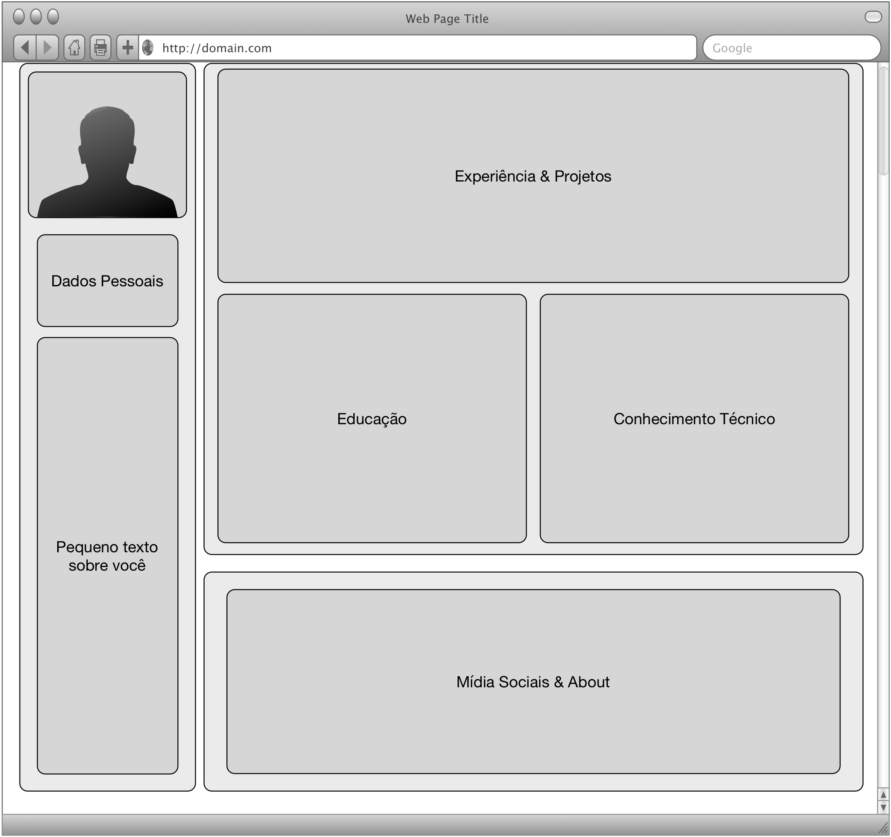
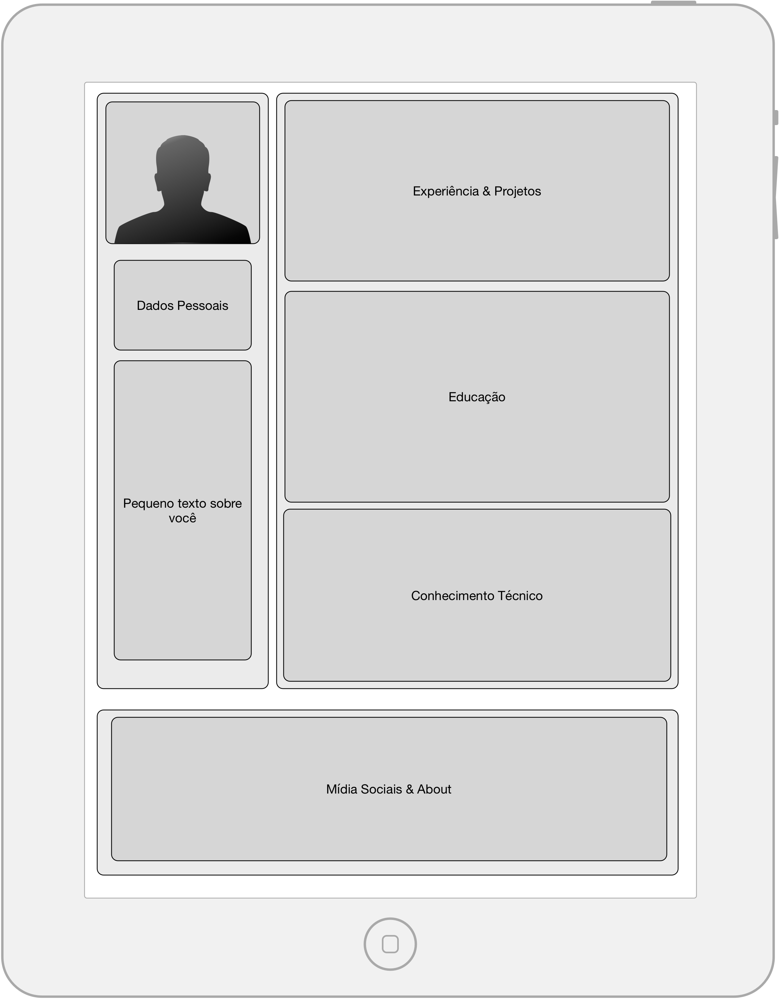
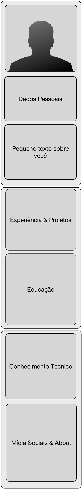

# Recuperação 1o Trimestre

### Desenvolvimento de Aplicações Web 

João Eduardo Montandon

Setor de Informática - COLTEC/MG

Valor: 30 pontos

## Curriculum Vitae

A web é a vitrine de qualquer profissional atualmente. Por meio de um portfolio na web, é possível mostrar ao mundo suas habilidades e especialidades. 

Nessa atividade, você deverá criar uma página para o currículo de alguma personalidade da área da computação. Você pode utilizar como referência a [lista de ganhadores do prêmio Turing](https://pt.wikipedia.org/wiki/Pr%C3%AAmio_Turing). Mais especificamente, esse CV deverá conter quatro seções principais:

1. Resumo
2. Formação & Experiência
3. Premiações
4. Social & Rodapé

Algumas restrições foram definidas para cada uma das seções descritas anteriormente, assim como para o site como um todo. Os requisitos estão descritos abaixo:

### Layout da Página

A página deverá suportar três tipos diferentes de layout: Desktop, Tablet e Mobile. Recomenda-se que a divisão entre as telas aconteça com base nos seguintes parâmetros:

* Desktop com largura de pelo menos `960px`
* Tablet com largura entre `648px` e `959px`
* Mobile com largura de até `647px`

Para implementação do layout responsivo, você deverá utilizar um layout de grid de 12 colunas. Você poderá utilizar o layout de colunas do bootstrap para isso. As imagens abaixo consistem em **sugestões** de protótipos para cada um dos três layouts. Você pode optar por um layout diferente, desde que obedeça às seguintes restrições:

* Presença obrigatória de rodapé nos três layouts
* Layout Desktop e Tablet com pelo menos duas áreas lado-a-lado
* Layout Mobile totalmente verticalizado
* Os três layouts devem ser estruturados de formas distintas.

### Estilo Padrão

Você deverá customizar a fonte da página utilizando dois estilos diferentes: Uma para títulos e destaques, e outra para texto e outras informações convencionais. *Sugestão: utilize uma fonte do [Google Fonts](https://fonts.google.com/)*.

Além disso, você deverá definir uma paleta de 5 cores distintas para serem utilizadas na página. *Sugestão: utilize uma paleta pronta do [Adobe Kuler](https://color.adobe.com/explore/?filter=random&time=all)*.

Você deverá utilizar ícones para para complementar as informações de pelo menos duas seções.

### Resumo

O resumo deverá contar com foto, local, informação de contato, além de um pequeno texto de resumo (máximo 2 parágrafos).

Você deverá aplicar algum tipo de filtro sobre a foto, como [borrado](https://www.w3schools.com/cssref/css3_pr_filter.asp), [escurecimento](https://www.w3schools.com/cssref/css3_pr_filter.asp), [etc](https://www.w3schools.com/cssref/css3_pr_filter.asp).

Aplique uma cor de destaque sobre a área de resumo, para que se possa se destacar das demais.

### Experiência & Formação

Ambos os tópicos deverão fazer parte da seção principal do site. As experiências deverão mostrar os grandes projetos no qual a personalidade já trabalhou anteriormente. Cada oportunidade deverá ter um título, data de início e fim, e um pequeno texto resumindo cada atividades.

De forma análoga, a formação também deverá constar com um título (nome da instituição), data de conclusão, e uma pequena descrição dizendo qual curso foi feito.

### Prêmios

Essa seção deverá exibir os prêmios e menções honrosas da personaldiade. Você deverá exibir cada prêmio em um formato similar a de um cartão. Esses cartões deverão ser apresentar efeitos animados ao interagirem com usuário (escala, mudança de cores, etc). É importante ressaltar que a seção de Prêmios deverá pertencer a mesma área de experiência e formação da página.

### Social & Rodapé

Essa seção deverá ser estruturada no formato de uma barra inferior. Essa barra deverá mostrar o acesso às redes sociais no formato de ícones em um tamanho grande o suficiente para ser confortável. Ainda, é importante adicionar um texto de copyright em seu rodapé.